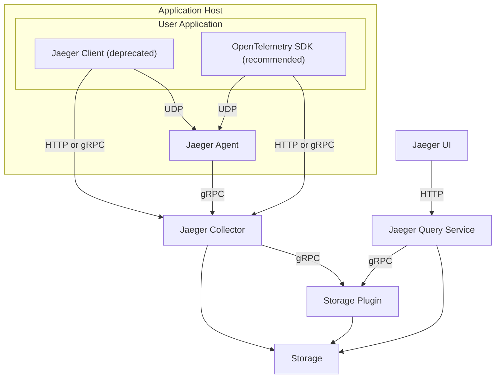

# This is my repository store docker use in my work

1. [Kafka cluster docker-compose](kafka_cluster.md)
2. [Redis cluster docker-compose](redis_cluster.md)
3. [Build distroless image for Golang](build_distroless_image_for_golang.md)

